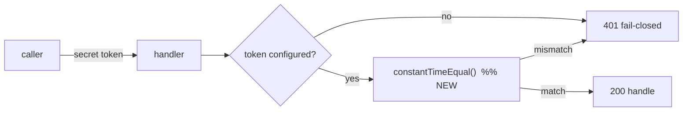
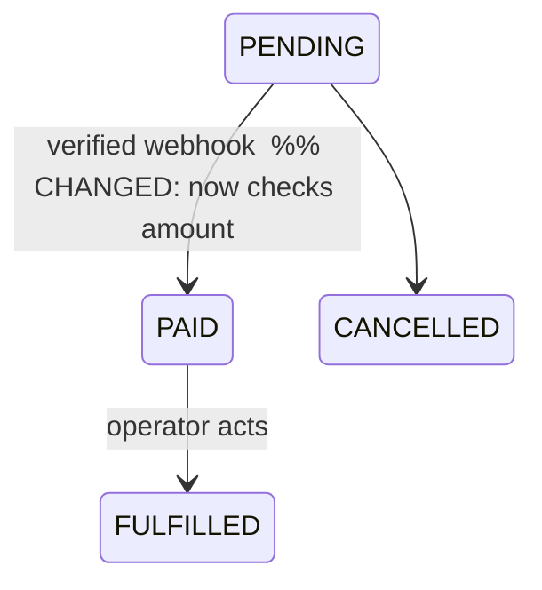

# Opening a pull request

A PR is a durable artifact other people (and future-you) read to understand *why* a change exists
and *what* it touches. These standards make every PR reviewable, self-documenting, and consistent.
Follow them any time you open a PR — the goal is that a reviewer understands the change in under a
minute and trusts it's safe to merge.

This skill is **project-agnostic**. Step 0 is discovering how *this* repo works; the rest are the
standards to apply on top of what you find.

---

## 0. Discover this project's conventions first (don't assume)

Spend 30 seconds learning the repo before you branch. What you find overrides the generic defaults
below.

- **Base branch** — `git symbolic-ref --short refs/remotes/origin/HEAD` (usually `main`, sometimes
  `master`/`develop`). If a `develop` branch exists it's typically the integration base for
  features, with `main` reserved for releases/hotfixes (classic git flow). Otherwise it's
  trunk-based: branch off and PR into the default branch.
- **Branch-name conventions already in use** — skim `git branch -r`; match the prefixes the repo
  already uses instead of inventing new ones.
- **Docs location** — look for `docs/`, `CONTRIBUTING.md`, a docs mapping table, a wiki pointer, or
  a `docs-coverage`-style CI job. That tells you where documentation is expected to live.
- **Tests + what "green" means** — read `package.json` scripts, `Makefile`, `pyproject.toml`,
  `go.mod`, and especially the CI workflow (`.github/workflows/*`, `.gitlab-ci.yml`, etc.). CI is
  the source of truth for which checks must pass and any coverage gates.
- **Build / lint commands and traps** — from the same sources plus any `CLAUDE.md` / `AGENTS.md` /
  `CONTRIBUTING.md` (repos often document commands that behave differently than the obvious one).
- **Existing PR template** — `.github/PULL_REQUEST_TEMPLATE.md` (or `docs/`/`.gitlab/`). If present,
  fill *its* sections and still add the flow diagram (§7).

If you can't determine one of these, ask the user rather than guessing — but usually the repo tells
you.

---

## 1. Branch — never commit to the base branch

- **Cut a fresh branch** from the base branch. Never commit directly to `main`/`master`/`develop`.
  If you're already on the base branch with local changes, create the branch first, then commit.
- **One branch = one concern.** Ship the main change as one focused PR plus small follow-ups, not a
  grab-bag. Don't pile unrelated changes onto an existing feature branch.
- **Name it `<type>/<short-kebab-description>`** using the type vocabulary the repo already uses.
  Common set:

  | Prefix | For |
  |---|---|
  | `feat/` | new user-facing capability |
  | `fix/` | bug fix |
  | `hotfix/` | urgent fix straight to prod |
  | `refactor/` | behavior-preserving restructure |
  | `docs/` | docs-only |
  | `test/` | tests-only |
  | `ci/` | pipeline / workflow |
  | `chore/` | deps, tooling, housekeeping |
  | `security/` | security hardening / vuln fix |

- **Base off the integration branch**, not off another unmerged feature branch (that entangles the
  diffs). Delete the branch after merge.

## 2. Docs travel with the code (same PR)

Any PR that changes behavior updates the matching documentation **in the same PR** — the API doc,
the README section, the runbook, whatever the repo uses. If the repo has a docs-coverage gate, treat
its green state as required, not an optional warning. Docs-only or pure-config PRs are exempt — just
say so in the body. The reason: a reviewer (and the next person to touch the code) should never have
to reverse-engineer intent that the diff changed but the docs still describe the old way.

## 3. Tests travel with the code (same PR)

New or changed behavior ships with tests in the same PR, matching the repo's framework and
conventions (find them in the existing test suite — don't introduce a new framework). If a change
genuinely isn't test-observable (a constant-time comparison, a header tweak a unit test already
covers, a pure refactor with existing coverage), **state why** in the PR body instead of adding a
hollow test.

## 4. Verify green BEFORE opening the PR

Never open a PR with red local checks — it wastes reviewer attention and CI minutes. Run what the
project uses (from Step 0): build, lint/format, unit + integration/e2e tests, and any codegen/synth
step for infra changes. Paste the command and result into the PR body (§6). If something can't be
run locally, say so explicitly rather than implying it passed.

## 5. Commit

- **Conventional commits**: `type(scope): subject` in the imperative
  (`fix(auth): reject expired tokens`). Same type vocabulary as the branch prefixes.
- Keep the subject short (~72 chars); put the "why" in the body.
- Add a co-authorship trailer if that's the environment's convention, e.g.:
  ```
  Co-Authored-By: Claude <noreply@anthropic.com>
  ```

## 6. PR body — use the template

Title = the conventional-commit subject. Body = this template, with every section filled (delete one
only with a one-line reason). **The Mermaid flow diagram (§7) is required.**

```markdown
## Summary
One or two sentences: what this PR does and why it exists.

## Why
The problem / ticket / finding this addresses. Link it.

## Flow of the change
```mermaid
flowchart LR
  %% REQUIRED — see §7. Diagram the path/flow this PR changes.
```

## Changes
- Concrete edits, grouped by area (backend / frontend / infra / docs).

## Testing & verification
- What ran green (build, lint, unit, e2e, infra synth, manual/browser check). Command + result.

## Docs
- Which doc was updated, or "N/A — <reason>".

## Risk & rollback
- Blast radius if it breaks, and how to revert (flag flip, revert commit, etc.).

## Links
- Ticket / finding / related PRs.
```

If the repo has its own `PULL_REQUEST_TEMPLATE.md`, fill that instead and graft the **Flow of the
change** diagram into it.

## 7. The flow diagram (REQUIRED)

Every PR body carries a **Mermaid** diagram of *the change itself* — the request path, data flow,
state transition, or a before→after — not a generic architecture picture. It's the fastest way for a
reviewer to see what actually moved. Rules of thumb:

- `flowchart` for request/data paths and control flow.
- `sequenceDiagram` for multi-service / async interactions (queues, webhooks, workers).
- `stateDiagram-v2` for status/state-machine changes.
- Show only the nodes the PR touches, and mark what's new/changed with a `%% NEW` / `%% CHANGED`
  comment or a highlighted node, so the delta is obvious at a glance.

**Example — a constant-time token-compare fix:**



**Example — a state-machine change:**



---

## Quick checklist

- [ ] Learned this repo's base branch, docs location, test/build commands, CI gates (Step 0).
- [ ] Branch is `type/kebab-desc`, cut from the base branch, one concern. Not committed to base.
- [ ] Commits are conventional (+ co-author trailer if conventional here).
- [ ] Docs updated in this PR (or N/A with a reason).
- [ ] Tests added/updated in this PR (or a reasoned exemption).
- [ ] Local build/lint/test/synth ran green before pushing.
- [ ] PR body follows the template **with a Mermaid flow diagram of the change**.
- [ ] Risk & rollback stated; ticket/finding linked.
